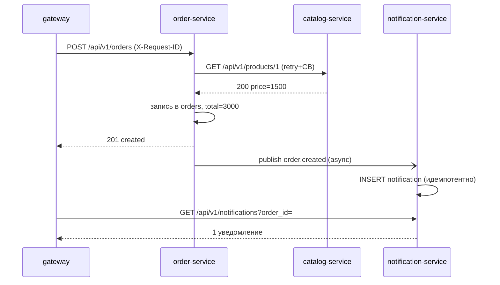

# OrderFlow Services

[](https://github.com/AlexGoster/orderflow-services/actions/workflows/ci.yml)


**Микросервисная версия платформы OrderFlow**: монолит из [orderflow-core](https://github.com/AlexGoster/orderflow-core) разобран на 4 сервиса с API-шлюзом, синхронными вызовами через HTTP и асинхронным обменом событиями. Ключевая идея — **отказ одного сервиса не останавливает приём заказов** (проверено тестом на circuit breaker).

## Архитектура

```mermaid
flowchart TB
    C[Клиент] -->|X-Request-ID| G[gateway :8000]
    G -->|HTTP proxy| CAT[catalog-service :8001<br/>своя БД]
    G --> ORD[order-service :8002<br/>своя БД]
    G --> NOTIF[notification-service :8003<br/>своя БД]
    ORD -->|GET /products/{id}<br/>tenacity retry + circuit breaker| CAT
    ORD -->|publish order.created| BUS[(Redis pub/sub)]
    BUS --> NOTIF
```

| Сервис | Ответственность | БД | Взаимодействие |
|---|---|---|---|
| `gateway` | Единая точка `/api/v1/*`, correlation id, трансляция ошибок | — | HTTP proxy |
| `catalog-service` | CRUD каталога | `catalog` | публичный API |
| `order-service` | Создание заказов, проверка товаров | `orders` | вызывает catalog, публикует события |
| `notification-service` | Уведомления по событиям | `notifications` | подписан на шину |

Общие контракты (`shared/`) — Pydantic-схемы API и событий: сервисы обмениваются только ими, ORM-модели локальны.

## Отказоустойчивость

- **Retry с backoff** (tenacity): transient-ошибки catalog-service повторяются до 3 раз
- **Circuit breaker** (своя state-машина `closed → open → half_open`): после порога отказов вызовы прекращаются, заказ уходит в **degraded** с предупреждениями в ответе — API отвечает `201`, а не падает
- **Публикация событий не ломает ответ**: ошибка шины логируется, клиент всё равно получает заказ
- **Idempotent-уведомление**: повторная доставка `order.created` не создаёт дубль
- **Correlation id**: `X-Request-ID` проходит шлюз → order → catalog → логи всех сервисов (JSON с `request_id`)

## Сценарий «всё вместе»



## Стек

FastAPI ×4 · httpx (ASGI-транспорты) · tenacity (retry) · собственный circuit breaker · Redis pub/sub (in-memory шина в тестах) · SQLAlchemy 2.0 async · SQLite/aiosqlite (тесты) / PostgreSQL (прод) · Pydantic v2 · pytest · ruff · mypy strict

## Запуск

```bash
docker compose up -d
# Шлюз: http://localhost:8000/docs
```

Стек: `gateway`, `catalog`, `order`, `notification`, `db`, `redis`. Каждый сервис собирается в свой образ из общего Dockerfile (`--build-arg SERVICE=...`).

## Тесты

**27 тестов, покрытие 89%** — без Docker, Redis и сети (ASGI-транспорты + in-memory шина):

- сквозной сценарий: товар через шлюз → заказ → уведомление;
- **degraded**: catalog недоступен → `201` + `degraded=true` + warnings;
- **retry**: 2 отказа → успех на 3-й попытке (счётчик вызовов проверен);
- **circuit breaker**: после порога сеть не трогается, переходы `open → half_open → closed`;
- correlation id на всём пути, контракты событий, health всех 4 сервисов.

CI: `ruff → mypy (strict, 54 файла) → pytest --cov → docker compose config + build ×4`.

## Trade-offs (честно)

**Почему REST внутри + pub/sub для событий**
- REST между gateway/order/catalog — синхронная проверка цены нужна до ответа клиенту;
- pub/sub для `order.created` — уведомления не должны влиять на latency заказа.
- Альтернатива (всё через очередь) усложнила бы проверку товара: клиент ждал бы ответ по HTTP.

**Что сломалось при разделении монолита**
1. Дублирование схем: контракты вынесены в `shared/`, но миграции и модели теперь в 3 БД — их синхронизировать сложнее.
2. Распределённые транзакции: списание денег и создание уведомления уже не в одной транзакции — нужны сага/компенсации.
3. Наблюдаемость: один лог запроса теперь собирается из 3 сервисов — без correlation id их не склеить.

## Как дальше до production

- Kubernetes + Helm, health/readiness probes, HPA
- Schema registry для событий, версионирование контрактов (`order.created.v2`)
- Saga-оркестратор вместо «best effort» публикации
- Istio/linkerd: межсервисный mTLS и retry на уровне инфраструктуры

## Лицензия

[MIT](LICENSE)
